<<<<<<< HEAD
# Name : Jochebed Fafa Kumor
# StudentID : 11305467

## Introduction & Purpose
This website is designed to provide information about the department of computer science at university of Ghana's academic programs, research activities, and upcoming events.
Whether you are a prospective student, current student, or just interested in computer science, you will find valuable resources here.
The website functions as a centralized hub, ensuring 24/7 accessibility to crucial information, including academic programs, faculty profiles, research initiatives, and event announcements. 
It provides a dedicated space to showcase faculty research, publications, and achievements.It also offers resources for students(both prospective and current students)
such as course materials, syllabi, academic policies, and support services

## Cloning and Setup Instructions
To clone and set up the project, follow these steps:

1.  Open your terminal and navigate to the directory where you want to clone the project.

2.  Run the following command: " git clone https://github.com/amfafa/11305467_DCIT205.git "
3.  cd " 11305467_DCIT205 "
4.  Open the project in your preferred code editor. 

### The home page
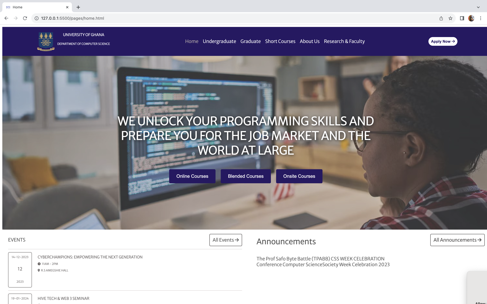

### The Research & Faculty page
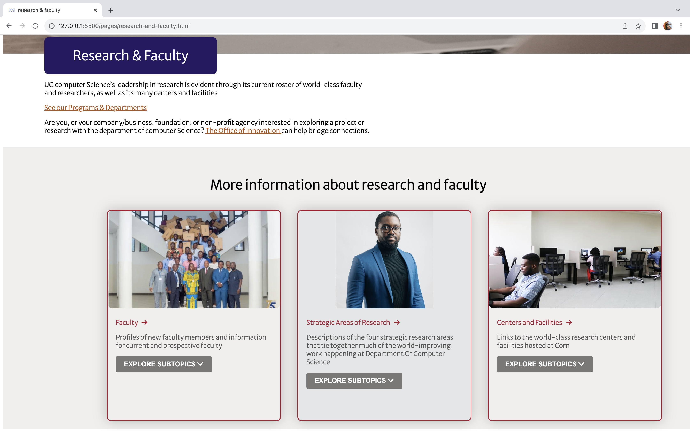

### The Short Courses Page
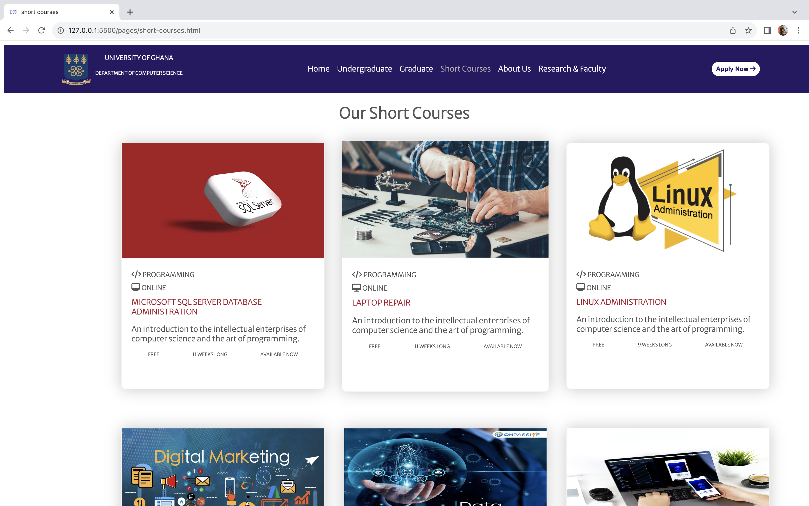
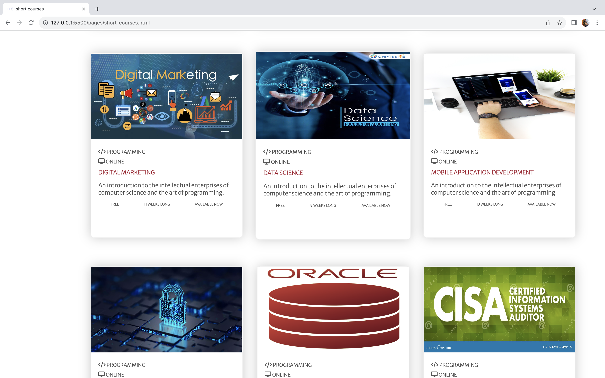

### The about page
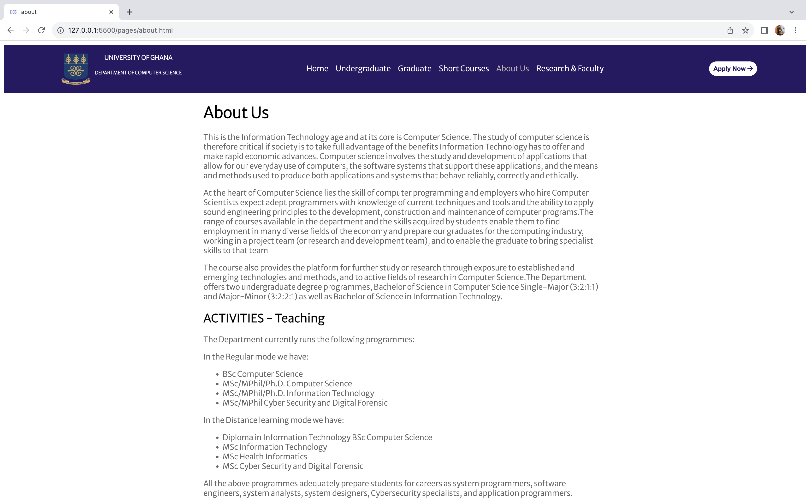

### The Undergraduate page
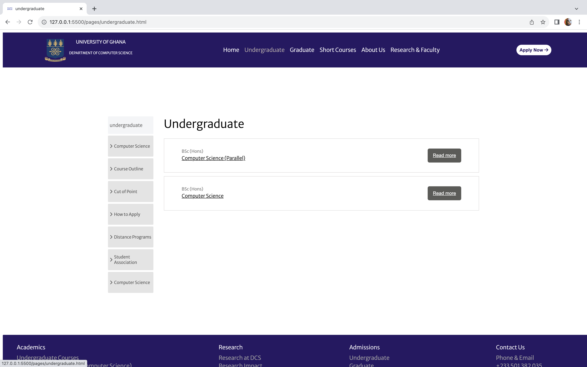

### This section talks about the details involving the course as an undergrduate and the admission requirements.
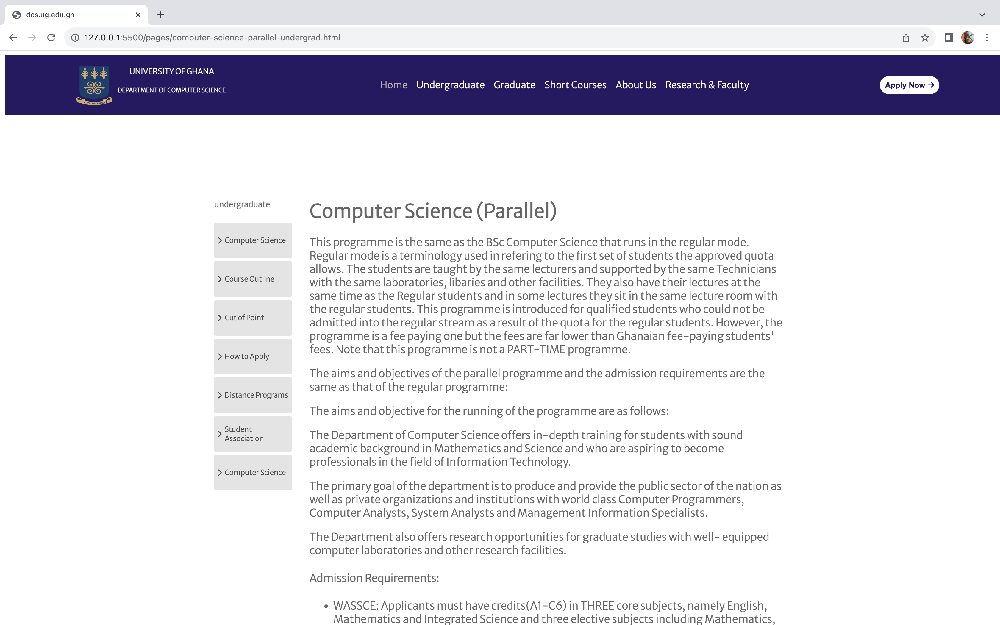
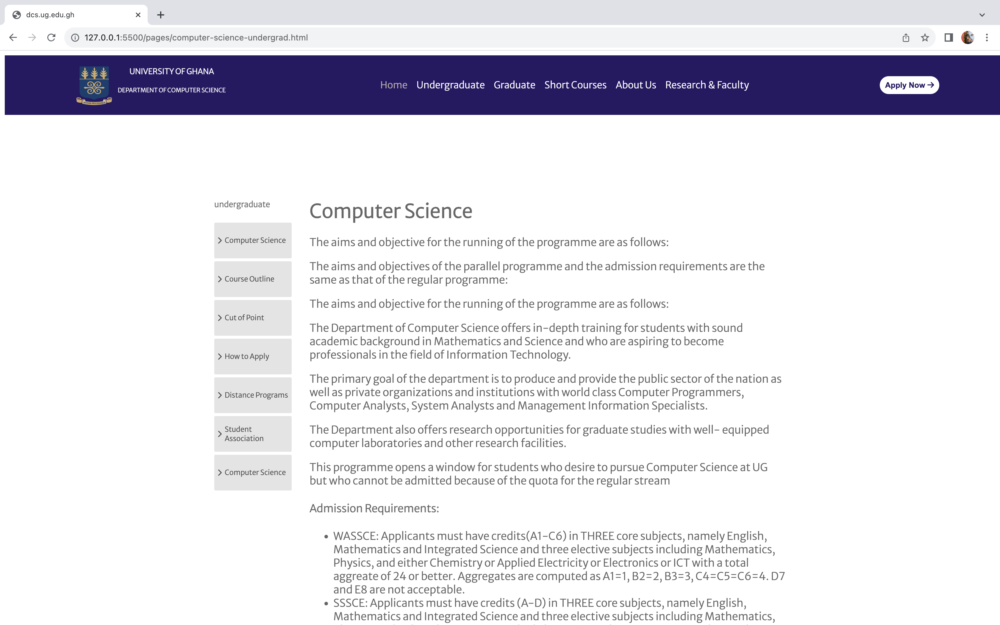

### The Graduate page
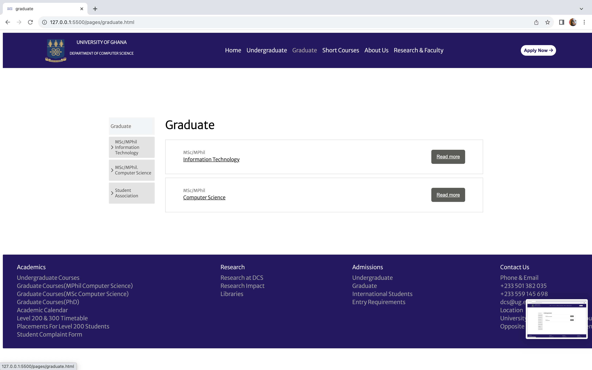

### This section talks about the details involving the course as a graduate and the admission requirements.
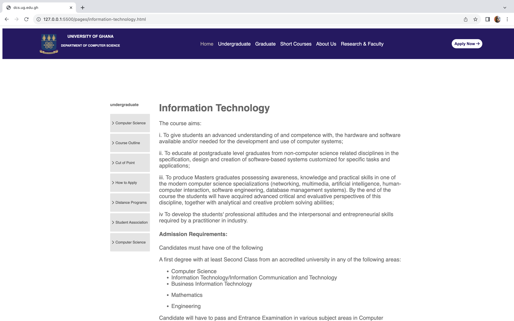
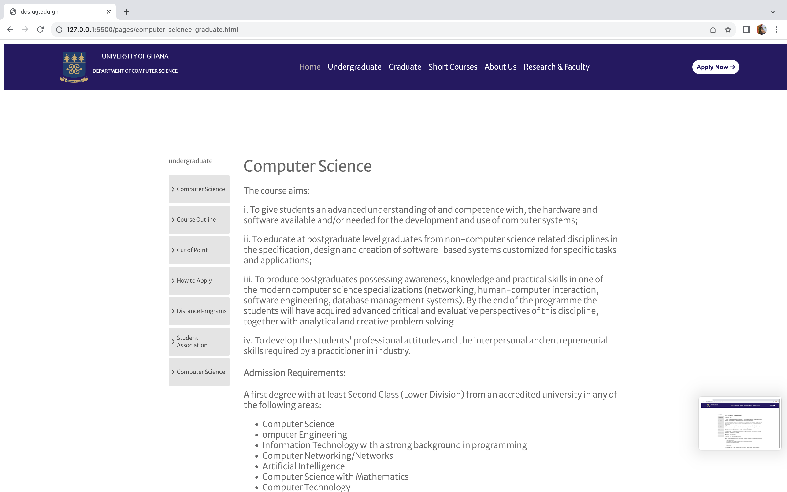

### Lessons Learned
Throughout the development of this project, I have gained valuable experience in web development. Some key takeaways include:

Frontend Development: Improved skills in HTML & CSS.
Web Design: Explored design principles for creating a nice, pleasing and user-friendly interface.
Version Control: Practiced using Git for version control.some of the commands i learnt was "git add .","git commit -m"--message--" ","git pull","git clone","git push"

### Contributing
Contributions to this project are welcome.Feel free to open issues or submit pull requests to suggest improvement.

### Contact Information
If you have any inquiries, feel free to reach out:

Email: jfkumor@st.edu.ug.gh

Phone: +233554873753

=======
# DCIT_205_IA
>>>>>>> 40a3d275bcc72b2489091be5c6ce5f88407551b5
